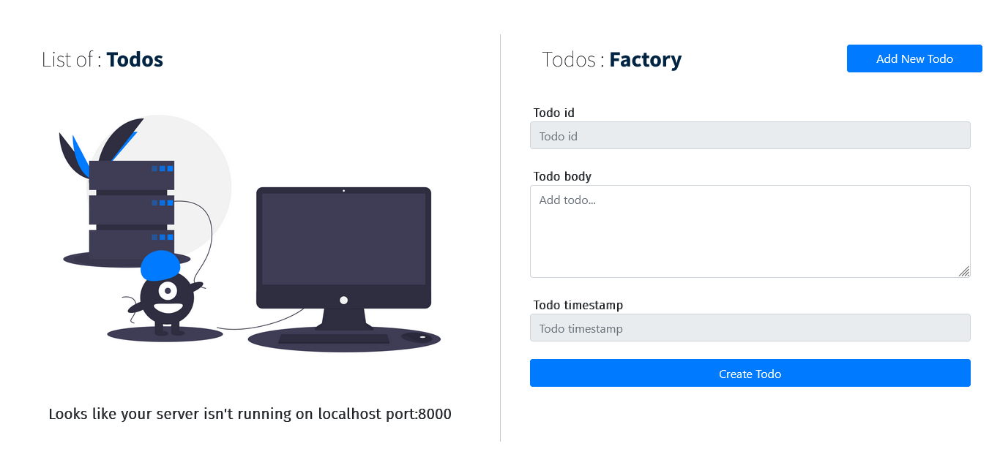

# asynchronous-todo-application



clone the boilerplate code from this repository: https://github.com/apprenticecloud/asynchronous-todo-application

In this assignment you are supposed to convert the todo application to utilize a fake json server and asynchronous api calls. Resources on how to do that are already in the projects module that is the (asynchronous communication - advanced). Make sure you go through the resources. __This will ease in the pressure that may arise if you have never used axios or json-server before__.

#### Quickstart on how to start the fake server.

first go into the fake-api folder in the repo and open the terminal from there then type out the following command in order

```bash
    npm install -g json-server
```

```bash
    npm install
```

```bash
    json-server --watch db.json --port 8000
```

___

Although, I highly recommend you go and watch the json-server resource before doing all this. Also watch the axios resource.

The main.js file in this project might have some alterations as I had put in some examples for you. The original file structure can be found in the following repository: https://github.com/EdwinMurimi/todo-test-app

Here you will get the original code and you could clone it and interact with the todo app and get to understand it better before translating it into the asynchronous api calls using json-server and axios.


__NOTE:__ This application can be difficult to anyone who is new to programming not forgetting anyone who has never used json-server or axios before so I recommend you watch the videos in the resource before attempting this.

__NOTE:__ Let your server run on port 8000. This is mandatory for all of us to be able to test out your published final application (more on the port stuff can be found in the resource).

Happy coding :)